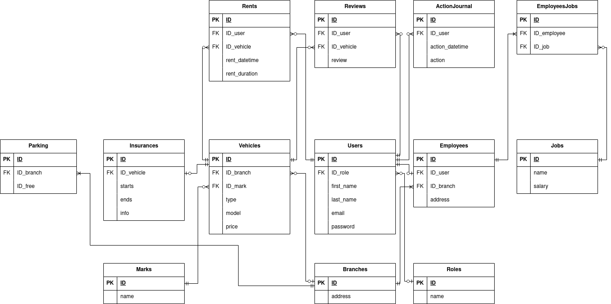

<!DOCTYPE html>
<html lang="ru">
<head>
    <meta charset="UTF-8">
</head>
<body>
    <h1>Тема: Аренда транспорта</h1>
    
ФИО: Матвеев Назар Сергеевич

    
Номер группы: 153502

    <h2>Функциональные требования</h2>
    <ol>
        <li>Авторизация и управление пользователями
            <ul>
                <li>Регистрация новых пользователей с указанием имени, фамилии, адреса электронной почты и пароля</li>
                <li>Вход в систему с использованием логина и пароля</li>
            </ul>
        </li>
        <li>Управление пользователями (CRUD):
            <ul>
                <li>Создание новых пользователей с указанием основной информации</li>
                <li>Просмотр информации о пользователях</li>
                <li>Редактирование данных пользователя</li>
                <li>Удаление данных пользователя</li>
            </ul>
        </li>
        <li>Система ролей:
            <ul>
                <li>Определение различных ролей пользователей (например, администратор, сотрудник авиакомпании, клиент и т.д.)</li>
                <li>Привязка ролей к пользователям</li>
                <li>Управление правами доступа на основе ролей</li>
            </ul>
        </li>
        <li>Журналирование действий пользователя:
            <ul>
                <li>Регистрация действий, совершаемых пользователями в системе</li>
                <li>Запись даты, времени и идентификатора пользователя при каждом действии</li>
            </ul>
        </li>
        <li>Транспорт:
            <ul>
                <li>Поддержка разных видов транспорта</li>
                <li>Возможность арендовать транспортное средство</li>
                <li>Возможность закончить аренду, оставив транспортное средство в отведенном месте</li>
            </ul>
        </li>
        <li>Управление списком доступного транспорта:
            <ul>
                <li>Возможность добавить или убрать транспортное средство для аренды</li>
                <li>Возможность изменить информацию о транспортном средстве</li>
            </ul>
        </li>
        <li>Система отзывов:
            <ul>
                <li>Возможность оставить отзыв о транспортном средстве</li>
            </ul>
        </li>
    </ol>
    <h2>Описание сущностей БД</h2>
    <h3>Пользователь (Users):</h3>
    <ul>
        <li>ID (Идентификатор): INT (Primary Key)</li>
        <li>first_name (Имя): CHAR</li>
        <li>last_name (Фамилия): CHAR</li>
        <li>role (Роль): CHAR</li>
        <li>email (Адрес электронной почты): CHAR UNIQUE</li>
        <li>password (Пароль): CHAR</li>
         
        
Ограничения: Нет дополнительных ограничений

        
Связи: Связь с таблицами ActionJournal (One-to-Many), Rents (One-to-Many), Employees (One-to-One)

    </ul>
    <h3>Сотрудник (Employees):</h3>
    <ul>
        <li>ID (Идентификатор): INT (Primary Key)</li>
        <li>ID_user (Идентификатор пользователя): INT UNIQUE (Foreign key)</li>
        <li>ID_branch (Идентификатор филиала): INT (Foreign Key)</li>
        <li>ID_Job (Идентификатор должности): INT (Foreign key)</li>
        <li>address (Адрес): TEXT</li>
         
        
Ограничения: Нет дополнительных ограничений

        
Связи: Связь с таблицами Users (One-to-One), Branches (Many-to-One), Jobs (Many-to-One)

    </ul>
    <h3>Должность (Jobs):</h3>
    <ul>
        <li>ID (Идентификатор): INT (Primary Key)</li>
        <li>name (Название): CHAR</li>
        <li>salary (Оклад): INT</li>
         
        
Ограничения: Нет дополнительных ограничений

        
Связи: Связь с таблицей Employees (One-to-Many)

    </ul>
    <h3>Журнал действий пользователя (ActionJournal):</h3>
    <ul>
        <li>ID (Идентификатор): INT (Primary Key)</li>
        <li>ID_user (Идентификатор пользователя): INT (Foreign Key)</li>
        <li>action (Описание действия): TEXT </li>
        <li>action_datetime (Дата и время действия): DATETIME</li>
         
        
Ограничения: Нет дополнительных ограничений

        
Связи: Связь с таблицей Users (Many-to-One)

    </ul>
    <h3>Аренда транспорта (Rents):</h3>
    <ul>
        <li>ID (Идентификатор): INT (Primary Key)</li>
        <li>ID_user (Идентификатор пользователя): INT (Foreign Key)</li>
        <lI>ID_vehicle (Идентификатор транспортного средства) INT UNIQUE (Foreign Key)</lI>
        <li>rent_datetime (Дата и время аренды): DATETIME</li>
        <li>rent_duration (Длительность аренды): TIME</li>
         
        
Ограничения: Нет дополнительных ограничений

        
Связи: Связь с таблицами Users (Many-to-One), Vehicles (Many-to-One)

    </ul>
    <h3>Транспортное средство (Vehicles):</h3>
    <ul>
        <li>ID (Идентификатор): INT (Primary Key)</li>
        <li>ID_branch (Идентификатор филиала): INT (Foreign Key)
        <li>type (Тип транспортного средства): CHAR</li>
        <li>mark (Марка): CHAR</li>
        <li>model (Модель): CHAR</li>
        <li>price (Стоимость аренды): INT</li>
         
        
Ограничения: Нет дополнительных ограничений

        
Связи: Связь с таблицами Rents (One-to-Many), Insurances (One-to-Many), Branches (Many-to-One)

    </ul>
    <h3>Парковочное место (Parking):</h3>
    <ul>
        <li>ID (Идентификатор): INT (Primary Key)</li>
        <li>ID_branch (Идентификатор филиала): INT (Foreign Key)
        <li>free (Занято/свободно): BOOL</li>
         
        
Ограничения: Нет дополнительных ограничений

        
Связи: Связь с таблицей Branches (Many-to-One)

    </ul>
    <h3>Страховка (Insurances):</h3>
    <ul>
        <li>ID (Идентификатор): INT (Primary Key)</li>
        <li>ID_vehicle (Идентификатор транспортного средства): INT (Foreign Key)
        <li>starts (Начало действия): DATETIME</li>
        <li>ends (Окончание действия): DATETIME</li>
        <li>info (Дополнительная информация): TEXT</li>
         
        
Ограничения: Нет дополнительных ограничений

        
Связи: Связь с таблицей Vehicles (Many-to-One)

    </ul>
    <h3>Отзыв (Reviews):</h3>
    <ul>
        <li>ID (Идентификатор): INT (Primary Key)</li>
        <li>ID_user (Идентификатор пользователя): INT</li>
        <li>ID_vehicle (Идентификатор транспортного средства): INT</li>
        <li>review (Отзыв): TEXT</li>
         
        
Ограничения: Нет дополнительных ограничений

        
Связи: Связь с таблицами Users (Many-to-One), Vehicles (Many-to-One)

    </ul>
    <h3>Филиал (Branches):</h3>
    <ul>
        <li>ID (Идентификатор): INT (Primary Key)</li>
        <li>address (Адрес): TEXT</li>
         
        
Ограничения: Нет дополнительных ограничений

        
Связи: Связь с таблицами Employees (One-to-Many), Vehicles (One-to-Many), Parking (One-to-Many)

    </ul>
    <h2>Схема БД</h2>
    

</body>
</html>
