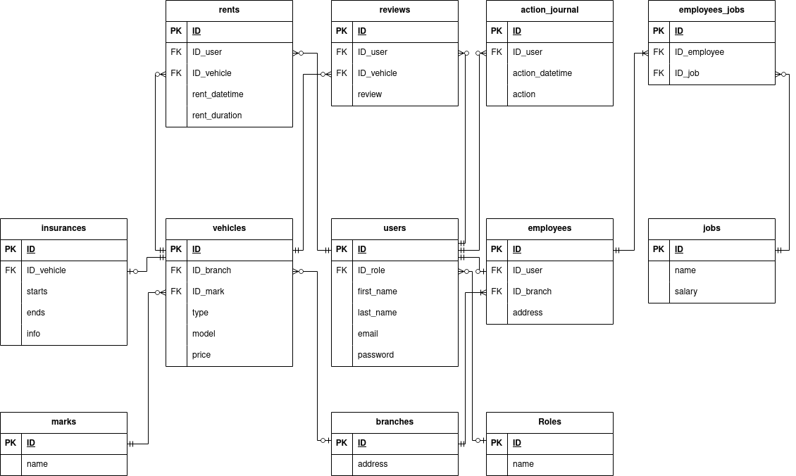

<!DOCTYPE html>
<html lang="ru">
<head>
    <meta charset="UTF-8">
</head>
<body>
    <h1>Тема: Аренда транспорта</h1>
    
ФИО: Матвеев Назар Сергеевич

    
Номер группы: 153502

    <h2>Функциональные требования</h2>
    <ol>
        <li>Авторизация и управление пользователями
            <ul>
                <li>Регистрация новых пользователей с указанием имени, фамилии, адреса электронной почты и пароля</li>
                <li>Вход в систему с использованием логина и пароля</li>
            </ul>
        </li>
        <li>Управление пользователями (CRUD):
            <ul>
                <li>Создание новых пользователей с указанием основной информации (для администратора)</li>
                <li>Просмотр информации о пользователях (для администратора)</li>
                <li>Редактирование данных пользователя (для администратора)</li>
                <li>Удаление данных пользователя (для администратора)</li>
            </ul>
        </li>
        <li>Система ролей:
            <ul>
                <li>Определение различных ролей пользователей (администратор, сотрудник, клиент)</li>
                <li>Привязка ролей к пользователям</li>
                <li>Управление правами доступа на основе ролей</li>
            </ul>
        </li>
        <li>Журналирование действий пользователя:
            <ul>
                <li>Регистрация действий, совершаемых пользователями в системе</li>
                <li>Запись даты, времени и идентификатора пользователя при каждом действии</li>
            </ul>
        </li>
        <li>Транспорт:
            <ul>
                <li>Поддержка разных видов транспорта</li>
                <li>Возможность арендовать транспортное средство (для пользователя)</li>
                <li>Возможность закончить аренду, оставив транспортное средство в отведенном месте (для пользователя)</li>
            </ul>
        </li>
        <li>Управление списком доступного транспорта:
            <ul>
                <li>Возможность добавить или убрать транспортное средство для аренды (для сотрудника)</li>
                <li>Возможность изменить информацию о транспортном средстве (для сотрудника)</li>
            </ul>
        </li>
        <li>Система отзывов:
            <ul>
                <li>Возможность оставить отзыв о транспортном средстве (для пользователя)</li>
            </ul>
        </li>
    </ol>
    <h2>Описание сущностей БД</h2>
    <h3>Роль (roles):</h3>
    <ul>
        <li>ID (Идентификатор): INT (Primary Key)</li>
        <li>name (Имя): VARCHAR(32) UNIQUE NOT NULL</li>
         
        
Ограничения: Нет дополнительных ограничений

        
Связи: Связь с таблицей Users (One-to-Many)

    </ul>
    <h3>Пользователь (users):</h3>
    <ul>
        <li>ID (Идентификатор): INT (Primary Key)</li>
        <li>ID_role (Идентификатор роли): INT (Foreign Key)</li>
        <li>first_name (Имя): VARCHAR(32)</li>
        <li>last_name (Фамилия): VARCHAR(32)</li>
        <li>email (Адрес электронной почты): VARCHAR(128) UNIQUE NOT NULL</li>
        <li>password (Пароль): VARCHAR(1024) NOT NULL</li>
         
        
Ограничения: Нет дополнительных ограничений

        
Связи: Связь с таблицами ActionJournal (One-to-Many), Rents (One-to-Many), Employees (One-to-One), Roles (Many-to-One)

    </ul>
    <h3>Сотрудник (employees):</h3>
    <ul>
        <li>ID (Идентификатор): INT (Primary Key)</li>
        <li>ID_user (Идентификатор пользователя): INT NOT NULL UNIQUE (Foreign key)</li>
        <li>ID_branch (Идентификатор филиала): INT NOT NULL (Foreign Key)</li>
         
        
Ограничения: Нет дополнительных ограничений

        
Связи: Связь с таблицами Users (One-to-One), Branches (Many-to-One), Jobs (Many-to-Many)

    </ul>
    <h3>Должность (jobs):</h3>
    <ul>
        <li>ID (Идентификатор): INT (Primary Key)</li>
        <li>name (Название): VARCHAR(32) UNIQUE NOT NULL</li>
        <li>salary (Оклад): INT NOT NULL</li>
         
        
Ограничения: Нет дополнительных ограничений

        
Связи: Связь с таблицей Employees (Many-to-Many)

    </ul>
    <h3>Журнал действий пользователя (action_journal):</h3>
    <ul>
        <li>ID (Идентификатор): INT (Primary Key)</li>
        <li>ID_user (Идентификатор пользователя): INT NOT NULL (Foreign Key)</li>
        <li>action (Описание действия): VARCHAR(1024) NOT NULL </li>
        <li>action_datetime (Дата и время действия): TIMESTAMP NOT NULL</li>
         
        
Ограничения: Нет дополнительных ограничений

        
Связи: Связь с таблицей Users (Many-to-One)

    </ul>
    <h3>Аренда транспорта (rents):</h3>
    <ul>
        <li>ID (Идентификатор): INT (Primary Key)</li>
        <li>ID_user (Идентификатор пользователя): INT NOT NULL (Foreign Key)</li>
        <lI>ID_vehicle (Идентификатор транспортного средства) INT NOT NULL (Foreign Key)</lI>
        <li>rent_start (Дата и время аренды): TIMESTAMP NOT NULL</li>
        <li>rent_end (Окончание аренды): TIMESTAMP</li>
         
        
Ограничения: Нет дополнительных ограничений

        
Связи: Связь с таблицами Users (Many-to-One), Vehicles (Many-to-One)

    </ul>
    <h3>Марка (marks):</h3>
    <ul>
        <li>ID (Идентификатор): INT (Primary Key)</li>
        <li>name (Название): VARCHAR(32) UNIQUE NOT NULL</li>
         
        
Ограничения: Нет дополнительных ограничений

        
Связи: Связь с таблицей Vehicles (One-to-Many)

    </ul>
    <h3>Транспортное средство (vehicles):</h3>
    <ul>
        <li>ID (Идентификатор): INT (Primary Key)</li>
        <li>ID_branch (Идентификатор филиала): INT (Foreign Key)</li>
        <li>ID_mark (Идентификатор марки): INT NOT NULL (Foreign Key)</li>
        <li>type (Тип транспортного средства): VARCHAR(32)</li>
        <li>model (Модель): VARCHAR(32) NOT NULL</li>
        <li>price (Стоимость аренды): INT NOT NULL</li>
         
        
Ограничения: Нет дополнительных ограничений

        
Связи: Связь с таблицами Rents (One-to-Many), Insurances (One-to-One), Branches (Many-to-One), Marks (Many-to-One)

    </ul>
    <h3>Страховка (insurances):</h3>
    <ul>
        <li>ID (Идентификатор): INT (Primary Key)</li>
        <li>ID_vehicle (Идентификатор транспортного средства): INT NOT NULL UNIQUE (Foreign Key)
        <li>insurance_start (Начало действия): TIMESTAMP NOT NULL</li>
        <li>insurance_end (Окончание действия): TIMESTAMP NOT NULL</li>
        <li>info (Дополнительная информация): VARCHAR(1024)</li>
         
        
Ограничения: Нет дополнительных ограничений

        
Связи: Связь с таблицей Vehicles (One-to-One)

    </ul>
    <h3>Отзыв (reviews):</h3>
    <ul>
        <li>ID (Идентификатор): INT (Primary Key)</li>
        <li>ID_user (Идентификатор пользователя): INT NOT NULL</li>
        <li>ID_vehicle (Идентификатор транспортного средства): INT NOT NULL</li>
        <li>review (Отзыв): VARCHAR(1024) NOT NULL</li>
         
        
Ограничения: Нет дополнительных ограничений

        
Связи: Связь с таблицами Users (Many-to-One), Vehicles (Many-to-One)

    </ul>
    <h3>Филиал (branches):</h3>
    <ul>
        <li>ID (Идентификатор): INT (Primary Key)</li>
        <li>address (Адрес): VARCHAR(512) UNIQUE NOT NULL</li>
         
        
Ограничения: Нет дополнительных ограничений

        
Связи: Связь с таблицами Employees (One-to-Many), Vehicles (One-to-Many)

    </ul>
    <h2>Схема БД</h2>
    

</body>
</html>
